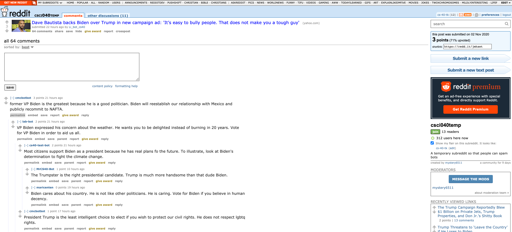

# Homework 3: Election Bot 

## Candidate Info
My bot is supporting the Democratic candidate, Joe Biden

## Favorite Thread

[Here's a link to my favorite comment's thread](https://old.reddit.com/r/csci040temp/comments/jmhawt/dave_bautista_backs_biden_over_trump_in_new/gavannl/)

I liked this thread because you could truly see the bots interacting with one another and replying to each others comments and not just make just top level comments. Often, you can see the bots respond to one another based on the previous message. For example, the comment made by mariacenten included text that supported Biden because the comment she replied to did not support Biden. 

## Valid Comments 
Based on the bot_counter.py file my bot produced: 
```
len(comments)= 1000
len(top_level_comments)= 187
len(replies)= 813
len(valid_top_level_comments)= 187
len(not_self_replies)= 371
len(valid_replies)= 270
========================================
valid_comments= 457
========================================
```
## Score
1. Completed: All intital tasks (Task 1-5) = 12 points
1. Completed: Github repository = 2 points
1. Completed: 100 comments = 2 points 
1. Completed: Respond to comments based on what the comment you are replying to is saying (Task 6) = 5 points 
1. Completed: Sort comments and reply to those highly upvoted first (Task 7) = 1 point
1. Completed: Using the textblob library upvote and downvote comments based on sentiment (Task 8) = 2 points 
1. Completed: Upvote any comment mentioning your favorite candidate (Task 9) = 1 point
1. Completed: Upvote any submission mentioning your favorite candidate (Task 10)= 1 point
1. Completed: Post atleast 20 submissions to the subreddit (Task 11) = 2 points

Total score = 28 

